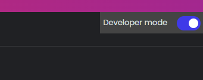

# Terms & Conditions / Privacy Policy Checker

## About

A Browser extension which states reliability of privacy policies and terms included in the webpage that is being viewed. This provides Integration and Innovation to Execution of AI based Extensions.

---

## Get Started

#### Prerequisites

- git
- python
- pip
- virtualenv

---

###### Django Server Start

First, clone the repository on your local machine.

```bash
# Using git command
git clone "https://github.com/bharathlakkoju/T_Checker"

# Using gh command
gh repo clone bharathlakkoju/T_Checker
```

After that, on the root directory use the following commands to create a virtual environment or install `virtualenv` to create a new virtual environment.

```bash
# If virtualenv is already installed
virtualenv env

# If virtualenv is not installed
pip install virtaulenv
virtualenv env
```

Now, change to the `webextension` directory and install the required dependencies mentioned in the `requirements.txt` using `pip`.

```bash
cd ./webextension/
pip install -r requirements.txt
```

After installing all the modules,

you just need to run the `Django` server.

```bash
py manage.py runserver
```

###### Web Extension Installation

- Open you browser (chrome, firefox, brave, etc..)
- click on `extensions` and enable `developer mode` to add custom extensions.

  

- You need to click on `Load unpacked` option to add new extension from local folder. Select the `webextension_ui` folder and then click `next` to add the extension.

Now, Your extension is loaded and ready to use.

---

Please the thank the contributors.
